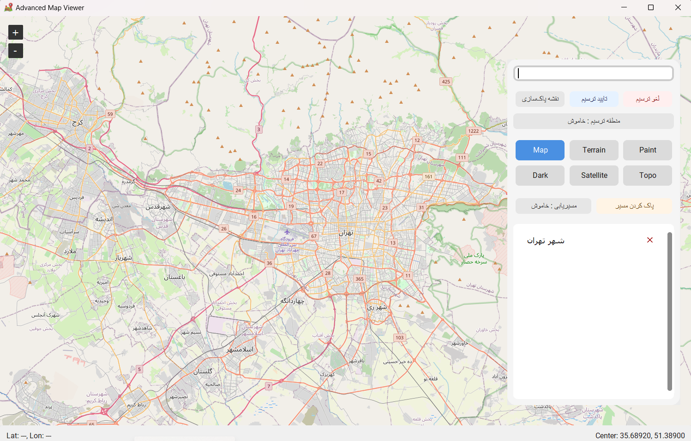

# 🗺️ Advanced Map Viewer | نمایشگر پیشرفته نقشه



---

> ⚠️ این پروژه در حال حاضر در نسخه اولیه قرار دارد و ممکن است شامل نواقص یا اشکالاتی باشد.  
> لطفاً در صورت مشاهده مشکل یا پیشنهاد، از طریق Issues یا Pull Request اطلاع دهید.

> ⚠️ This project is currently in an early version and may contain bugs or incomplete features.  
> Feel free to report issues or suggest improvements via GitHub Issues or Pull Requests.

---

## 🇮🇷 توضیحات فارسی

**Advanced Map Viewer** یک نرم‌افزار دسکتاپ برای مشاهده و مسیریابی روی نقشه‌های OpenStreetMap است که با استفاده از **Python** و کتابخانه‌های **CustomTkinter** و **TkinterMapView** ساخته شده است.  
این برنامه امکاناتی مانند جست‌وجوی مکان، تغییر استایل نقشه، ترسیم چندضلعی، مسیریابی بین دو نقطه و ذخیره تاریخچه مکان‌ها را فراهم می‌کند.

---

### ✨ ویژگی‌ها
- 🔍 جست‌وجوی مکان با استفاده از سرویس Nominatim  
- 🗺️ تغییر استایل نقشه (Map, Terrain, Satellite, Dark, Paint, Topo)  
- 📍 افزودن مارکر با کلیک روی نقشه  
- 📏 مسیریابی بین دو نقطه با نمایش فاصله و زمان تقریبی  
- 🖌️ ترسیم چندضلعی با پیش‌نمایش زنده  
- 💾 ذخیره تاریخچه مکان‌ها در فایل JSON  
- 🧹 پاک‌سازی سریع مارکرها، مسیرها و چندضلعی‌ها  

---

### ⚙️ پیش‌نیازها
برای اجرای برنامه، ابتدا Python 3.8+ را نصب کنید و سپس کتابخانه‌های زیر را نصب نمایید:

```bash
pip install customtkinter tkintermapview requests
```

---

### 🚀 اجرای برنامه
```bash
python mapviewer.py
```

---

### 📂 ساختار فایل‌ها
| فایل | توضیح |
|------|-------|
| `mapviewer.py` | فایل اصلی برنامه |
| `map.ico` | آیکون برنامه |
| `README.md` | داکیومنت پروژه |
| `LICENSE` | مجوز استفاده از نرم‌افزار |
| `requirements.txt` | لیست کتابخانه‌های مورد نیاز |
| `.gitignore` | جلوگیری از کامیت فایل‌های بی‌ربط |
| `history.json` | (اختیاری) نمونه‌ای از تاریخچه مکان‌ها |
| `assets/screenshot/main-ui.png` | تصویر محیط برنامه |

---

### 📜 لایسنس
این پروژه تحت مجوز [MIT](LICENSE) منتشر شده است.  
شما آزاد هستید از نرم‌افزار استفاده کرده، آن را تغییر داده و منتشر کنید، به شرطی که متن مجوز حفظ شود.

This project is licensed under the [MIT License](LICENSE).  
You are free to use, modify, and distribute this software with proper attribution.

---

## 🇬🇧 English Description


**Advanced Map Viewer** is a desktop application for viewing and routing on OpenStreetMap, built with **Python**, **CustomTkinter**, and **TkinterMapView**.  
It offers location search, map style switching, polygon drawing, routing between two points, and saving location history.

---

### ✨ Features
- 🔍 Location search using Nominatim API  
- 🗺️ Map style switching (Map, Terrain, Satellite, Dark, Paint, Topo)  
- 📍 Add markers by clicking on the map  
- 📏 Route between two points with distance and estimated time  
- 🖌️ Polygon drawing with live preview  
- 💾 Save location history in a JSON file  
- 🧹 Quick clear for markers, routes, and polygons  

---

### ⚙️ Requirements
Make sure you have Python 3.8+ installed, then install dependencies:

```bash
pip install customtkinter tkintermapview requests
```

---

### 🚀 Run the application
```bash
python mapviewer.py
```

---

### 📂 File structure
| File | Description |
|------|-------------|
| `mapviewer.py` | Main application code |
| `map.ico` | Application icon |
| `README.md` | Project documentation |
| `LICENSE` | Software license |
| `requirements.txt` | Dependency list |
| `.gitignore` | Prevents committing unnecessary files |
| `history.json` | (Optional) Sample location history |
| `assets/screenshot/main-ui.png` | App screenshot image |

---

### 📜 License
This project is licensed under the [MIT License](LICENSE).  
You are free to use, modify, and distribute this software with proper attribution.

این پروژه تحت مجوز [MIT](LICENSE) منتشر شده است.  
شما آزاد هستید از نرم‌افزار استفاده کرده، آن را تغییر داده و منتشر کنید، به شرطی که متن مجوز حفظ شود.